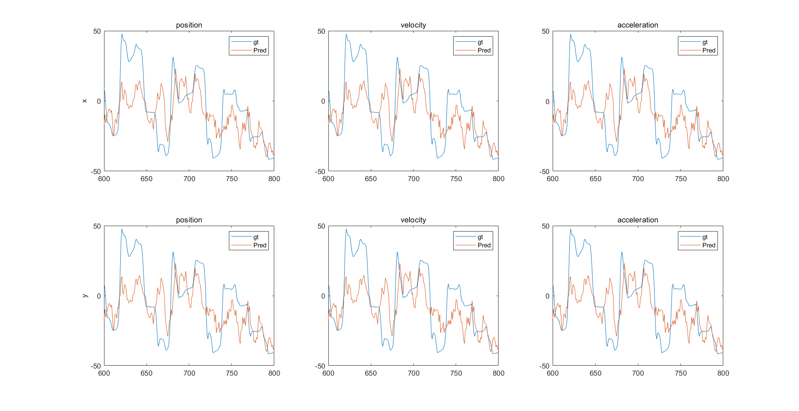
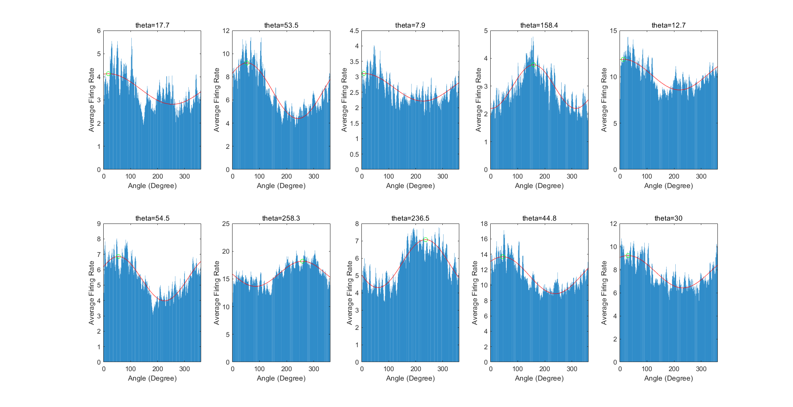
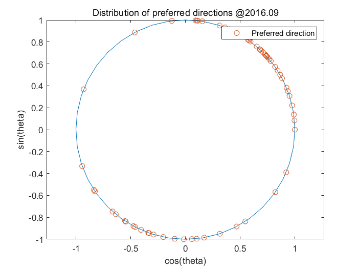
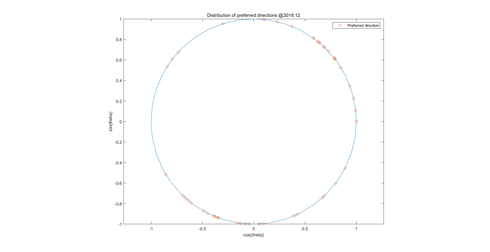

# SCNS assignment 4

> ## motion prediction with cortex electrophysiology

> 王敏行 2018012386 wangmx18@mails.tsinghua.edu.cn

本压缩包包含：

- `motionPred.m` Question 1主函数
- `kinematics.m` `linReg.m` `ButterLP.m` `count_firing_rates.m`分别用于对运动数据进行滤波+重采样，线性回归，低通滤波，spikes计数的函数，其中仅有`ButterLP.m`为本人自己完成。
- `indy_20160921_01.mat`等数据文件，需自行下载并放在目录下
- `Q2.m`由农宇涵完成
- `Q3.m`由农宇涵完成

#### Part 1

滤波器参数和原文献一致：4阶Butterworth滤波器，截止频率10Hz，采样频率250Hz。重采样的bin宽度耶和原文献一致，为64ms。

通过线性回归预测的恒河猴**indy**手部运动如下（`indy_20160921_01.mat`）：

#### Part 2

图片为`indy_20160921_01.mat`的不同神经元方向的偏好性（选了10个发放较为活跃的神经元）。

#### Part3

三个月前的方向偏好性已经在**part2**中展示，下图展示了三个月后的方向偏好性。

可以通过直观的肉眼观察，发现训练三个月后，恒河猴Indy的目标区域神经元分布更分散。即未经训练的恒河猴有较强的方向偏好性，这可能与其自然生活习性相关。训练后，恒河猴更能适应向不同方向的运动。这也暗示自然环境中对于生物而言向不同方向运动的权重是有差异的。
