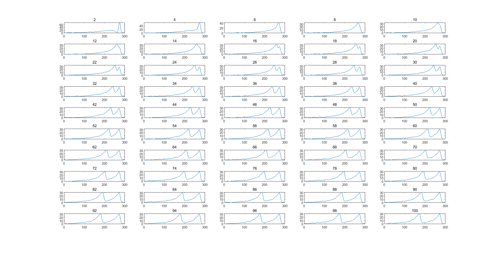

# SCNS assignment 3

> ## visual system

> 王敏行 2018012386 wangmx18@mails.tsinghua.edu.cn

### Question 1

#### Part 1

Single spike triggered average stimulus is shown as below. At $300 ms$ does the spike occurs.

Code is attached as `SpkTrigAvg.m`#`Part1`.

####　Part 2

Two-spikes triggered average stimuli with various separation are shown as below. At $300 ms$ does the spike occurs.

Code is attached as `SpkTrigAvg.m`#`Part2`.

### Question 2

Averaged 2D stimuli for each of the 12 time steps. Code is attached as `LGN.m`.

将上述图在x方向进行平均，得到下图：

